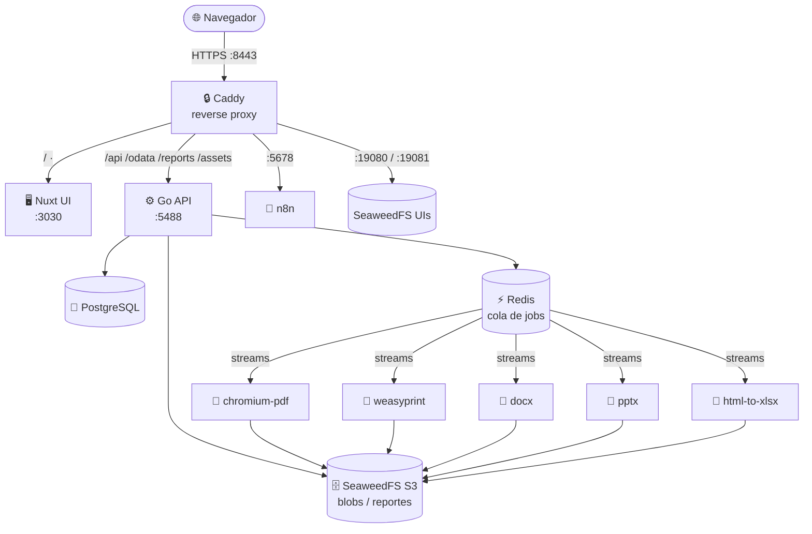
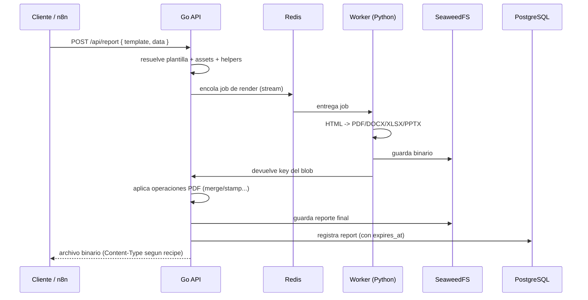
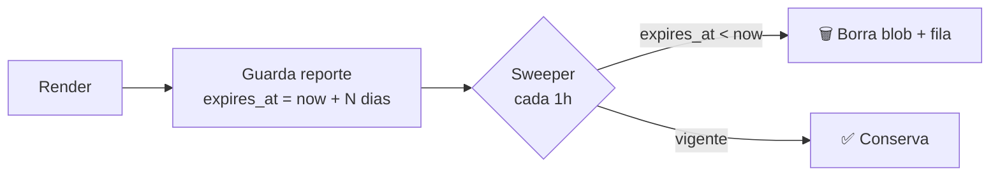

<div align="center">

# ☁️ Cloud-Report

**Diseñá plantillas HTML y servílas como PDF, DOCX, XLSX o PPTX desde una sola API.**

Plataforma de generación de reportes: **Go API** + **Nuxt UI** + **workers Python**, detrás de un **reverse proxy Caddy con HTTPS**, con **SeaweedFS (S3)**, **PostgreSQL**, **Redis** y **n8n** para automatización.

</div>

---

## 📑 Tabla de contenidos

- [✨ Características](#-características)
- [🏗️ Arquitectura](#️-arquitectura)
- [🧩 Stack](#-stack)
- [🚀 Puesta en marcha (Docker)](#-puesta-en-marcha-docker)
  - [1. Requisitos](#1-requisitos)
  - [2. Clonar y configurar](#2-clonar-y-configurar)
  - [3. Levantar todo](#3-levantar-todo)
  - [4. Acceder](#4-acceder)
- [⚙️ Configuración (`.env`)](#️-configuración-env)
- [🔌 Puertos](#-puertos)
- [🔄 Flujo de render](#-flujo-de-render)
- [📡 Uso de la API](#-uso-de-la-api)
- [🗂️ Estructura del proyecto](#️-estructura-del-proyecto)
- [🛠️ Desarrollo](#️-desarrollo)
- [🧪 Tests](#-tests)
- [🧹 Retención de reportes](#-retención-de-reportes)
- [🌐 Internacionalización](#-internacionalización)
- [❓ Troubleshooting](#-troubleshooting)

---

## ✨ Características

- 🧾 **Plantillas Handlebars** → render a **PDF (Chromium / WeasyPrint)**, **DOCX**, **XLSX**, **PPTX**, **HTML**.
- ✏️ **Editor visual** con resaltado de sintaxis, preview en vivo, tabs de Contenido / Estilos / Helpers / Data / Scripts / Recipe / Página / PDF ops.
- 🖼️ **Assets** (CSS, imágenes, fuentes) inlineables con `{#asset nombre}` — sin servidor de archivos externo.
- 🧷 **Operaciones PDF**: concatenar (`append`/`prepend`), estampar headers/footers en cada página (`merge` + `renderForEveryPage`).
- ⏳ **Retención por plantilla**: cada template define cuántos días se guardan sus reportes; un sweeper los borra solos.
- 🔐 **Auth con JWT** (sesión deslizante "no me deslogués nunca") + **API keys** para servidores.
- 👥 **Gestión de usuarios** (admin): crear, promover/degradar, eliminar.
- 🌐 **i18n ES/EN** en toda la app, con toggle en vivo.
- 📖 **Docs de la API embebidas** en `/docs`.
- 🤖 **n8n** integrado para automatizar renders desde workflows.
- 🔒 **HTTPS** vía Caddy (reverse proxy de frontend + backend + UIs).

---

## 🏗️ Arquitectura



El **navegador solo habla con Caddy** (HTTPS). El frontend usa rutas relativas (`/api`, `/odata`…) sobre el mismo origen, y Caddy las enruta al backend Go o al Nuxt según el path. Los workers de render corren en Python y reciben jobs por **streams de Redis**, devolviendo los binarios a **SeaweedFS**.

---

## 🧩 Stack

| Capa | Tecnología |
|------|------------|
| **Frontend** | Nuxt 3 + Nuxt UI 4 (Tailwind v4), Pinia, Shiki, iconos Lucide |
| **Backend** | Go (Fiber), JWT, pgx |
| **Workers** | Python — Chromium (Playwright), WeasyPrint, docxtpl, python-pptx, html-to-xlsx |
| **Base de datos** | PostgreSQL 16 |
| **Cola** | Redis 7 (streams) |
| **Almacenamiento** | SeaweedFS (API S3) |
| **Proxy / TLS** | Caddy 2 |
| **Automatización** | n8n (latest) |

---

## 🚀 Puesta en marcha (Docker)

### 1. Requisitos

- Docker + Docker Compose v2
- ~4 GB RAM libres (Chromium necesita headroom)

### 2. Clonar y configurar

```bash
git clone https://github.com/JoseHurtadoGonzales/CloudReport.git
cd CloudReport

# Copiá la plantilla de entorno y editala
cp .env.example .env
nano .env
```

Como **mínimo** cambiá en `.env`:

```bash
JWT_SECRET=$(openssl rand -hex 32)        # secreto random
INITIAL_ADMIN_USERNAME=tu-usuario          # admin inicial
INITIAL_ADMIN_PASSWORD=una-clave-fuerte
N8N_HOST=10.71.1.125                        # IP/dominio del server
N8N_WEBHOOK_URL=https://10.71.1.125:5678/
```

> Detrás de Caddy, **dejá `NUXT_PUBLIC_API_BASE` vacío** (el navegador usa rutas relativas).

### 3. Levantar todo

```bash
docker compose up -d --build
```

Esto construye y arranca: Postgres, Redis, SeaweedFS (master/volume/filer/s3), API Go, UI Nuxt, los 5 workers, Caddy y n8n. En el **primer arranque** se crea automáticamente el usuario admin definido en `.env`.

### 4. Acceder

| Servicio | URL | Credenciales |
|----------|-----|--------------|
| **App** | `https://<host>:8443` | tu admin de `.env` |
| **n8n** | `https://<host>:5678` | se configura al primer ingreso |
| **SeaweedFS filer UI** | `https://<host>:19080` | `admin` / `cloudreport` (o tu hash) |
| **SeaweedFS master UI** | `https://<host>:19081` | idem |

> La primera vez el navegador pedirá aceptar el certificado (es auto-firmado por Caddy en LAN sin dominio — normal).

---

## ⚙️ Configuración (`.env`)

| Variable | Default | Descripción |
|----------|---------|-------------|
| `JWT_SECRET` | `change-me-in-prod` | Secreto para firmar JWT. **Cambialo.** |
| `SESSION_TTL_HOURS` | `720` | Vida del token (720h = 30 días). El frontend lo renueva solo. |
| `ALLOW_REGISTRATION` | `true` | Habilita registro público. `false` para instalaciones cerradas. |
| `INITIAL_ADMIN_USERNAME/PASSWORD/EMAIL` | `admin / admin123` | Admin creado en el primer boot con DB vacía. |
| `NUXT_PUBLIC_API_BASE` | *(vacío)* | Vacío = rutas relativas detrás de Caddy. URL absoluta solo si NO usás proxy. |
| `CADDY_HTTPS_PORT` | `8443` | Puerto HTTPS público. En server dedicado poné `443`. |
| `N8N_HOST_PORT` | `5678` | Puerto de n8n. |
| `SEAWEEDFS_FILER_UI_PORT` / `MASTER_UI_PORT` | `19080` / `19081` | UIs de admin de SeaweedFS. |
| `SEAWEEDFS_UI_USER` / `PASSWORD_HASH` | `admin` / *(default)* | Basic-auth de las UIs de SeaweedFS. |

> 🔑 Para una clave propia de las UIs de SeaweedFS (escapando los `$` para Compose):
> ```bash
> docker run --rm caddy:2-alpine caddy hash-password --plaintext 'tu-clave' | sed 's/\$/\$\$/g'
> ```

---

## 🔌 Puertos

| Puerto host | Servicio |
|-------------|----------|
| `8443` | HTTPS — frontend + API (vía Caddy) |
| `5678` | n8n (vía Caddy) |
| `19080` / `19081` | SeaweedFS filer / master UI |
| `15432` | PostgreSQL (debug) |
| `16379` | Redis (debug) |
| `8333` / `8888` / `9333` / `8080` | SeaweedFS s3 / filer / master / volume (debug) |

> Los puertos por defecto son **alternos** para poder convivir con otro reverse proxy ya usando 80/443 en el mismo host. En un server dedicado, poné `CADDY_HTTPS_PORT=443`.

---

## 🔄 Flujo de render



---

## 📡 Uso de la API

**Renderizar una plantilla guardada:**

```bash
curl -X POST https://<host>:8443/api/report \
  -H "Authorization: Bearer <API_KEY>" \
  -H "Content-Type: application/json" \
  -d '{ "template": { "shortid": "<TPL>" }, "data": { "name": "Mundo" } }' \
  --output reporte.pdf
```

**Plantilla inline (sin guardarla):**

```bash
curl -X POST https://<host>:8443/api/report \
  -H "Authorization: Bearer <API_KEY>" \
  -H "Content-Type: application/json" \
  -d '{
    "template": { "content": "<h1>Hola {{name}}</h1>", "engine": "handlebars", "recipe": "chrome-pdf" },
    "data": { "name": "Ana" }
  }' --output out.pdf
```

> Generá tu API key en **Configuración → API Keys**. La doc completa está embebida en la app en **`/docs`**.

---

## 🗂️ Estructura del proyecto

```
cloud-report/
├── api/            # Backend Go (Fiber) — render, auth, OData, scheduler
│   ├── cmd/server/ # entrypoint
│   └── internal/   # auth, blob, config, odata, render, store...
├── ui/             # Frontend Nuxt 3 (pages, components, composables, stores)
├── workers/        # Workers Python (chromium, weasyprint, docx, pptx, html-to-xlsx)
├── caddy/          # Caddyfile (reverse proxy + TLS)
├── infra/          # config de SeaweedFS (s3.json)
├── docs/           # documentación adicional
├── docker-compose.yml
└── .env.example
```

---

## 🛠️ Desarrollo

```bash
# API (Go)
cd api && go run ./cmd/server

# UI (Nuxt) — hot reload en :3030
cd ui && npm install && npm run dev

# Levantar solo las dependencias (DB, Redis, SeaweedFS)
docker compose up -d postgres redis seaweedfs-s3
```

---

## 🧪 Tests

```bash
cd api
go test ./...        # ~189 casos: auth/JWT, config, OData, render, pdf-utils
go vet ./...
```

---

## 🧹 Retención de reportes

Cada plantilla tiene un campo **"Retención de reportes"** (pestaña *Página* del editor):

- Cada render se guarda en SeaweedFS + tabla `reports` con un `expires_at`.
- Un **sweeper** corre cada hora y borra (blob + fila) los reportes vencidos.
- Valores rápidos: 7 / 30 / 90 / 365 días, o **0 = no borrar nunca**.



---

## 🌐 Internacionalización

Toda la UI está en **Español** e **Inglés**. El toggle **ES / EN** está arriba a la derecha; la preferencia se guarda en cookie por un año. Para agregar strings: editás `ui/composables/useI18n.ts` (claves en ambos locales) y usás `t('mi.clave')` en el template.

---

## ❓ Troubleshooting

| Problema | Causa / solución |
|----------|------------------|
| Los iconos no cargan / cargan al recargar | El bundle de iconos es local (`@iconify-json/lucide`). Hacé **hard refresh** (Ctrl+Shift+R) tras un deploy. |
| `address already in use` en :8443/:80 | Otro proceso usa el puerto. Cambiá `CADDY_HTTPS_PORT` en `.env`. |
| El navegador desconfía del certificado | Es auto-firmado (TLS internal en LAN). Aceptalo, o configurá un dominio real en el `Caddyfile` para Let's Encrypt. |
| 401 en todas las llamadas | Token vencido o `JWT_SECRET` cambiado (invalida sesiones). Volvé a loguearte. |
| El admin inicial no se crea | Solo se crea con **DB vacía** en el primer boot. Si ya hay usuarios, creá desde *Configuración → Usuarios*. |

---

<div align="center">
<sub>Cloud-Report — generá reportes lindos, rápido. 🚀</sub>
</div>
